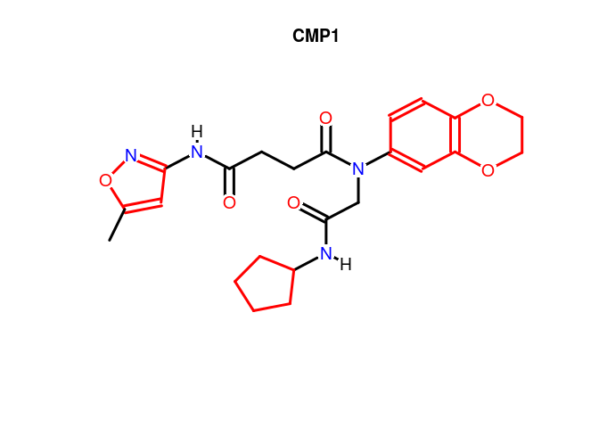
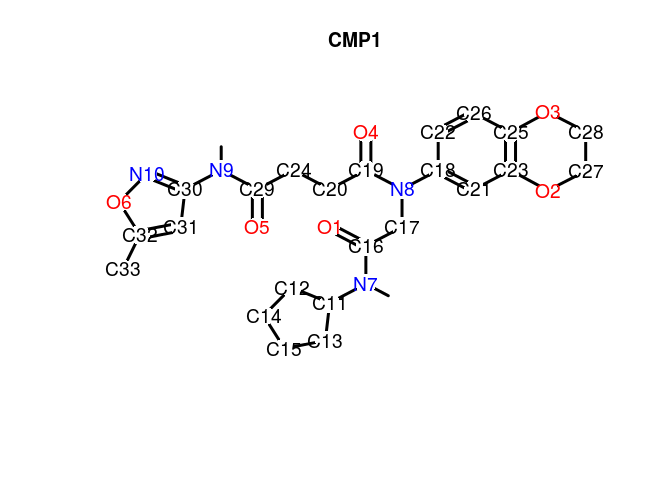

The function `rings` identifies all possible rings in one
or many molecules (here `sdfset[1]`) using the exhaustive
ring perception algorithm from Hanser et al. (1996). In addition, the function can 
return all smallest possible rings as well as aromaticity information.

The following example returns all possible rings in a
`list`. The argument `upper` allows to
specify an upper length limit for rings. Choosing smaller length limits
will reduce the search space resulting in shortened compute times. Note:
each ring is represented by a character vector of atom symbols that are
numbered by their position in the atom block of the corresponding
`SDF/SDFset` object. 


 ringatoms <- rings(sdfset[1], upper=Inf, type="all", arom=FALSE, inner=FALSE)


For visual inspection, the corresponding compound structure can be
plotted with the ring bonds highlighted in color: 


 atomindex <- as.numeric(gsub(".*_", "", unique(unlist(ringatoms))))
 plot(sdfset[1], print=FALSE, colbonds=atomindex) 


Alternatively, one can include the atom numbers in the plot:


 plot(sdfset[1], print=FALSE, atomnum=TRUE, no_print_atoms="H") 


Aromaticity information of the rings can be returned in a logical vector
by setting `arom=TRUE`: 


 rings(sdfset[1], upper=Inf, type="all", arom=TRUE, inner=FALSE) 



## $RINGS
## $RINGS$ring1
## [1] "N_10" "O_6"  "C_32" "C_31" "C_30"
## 
## $RINGS$ring2
## [1] "C_12" "C_14" "C_15" "C_13" "C_11"
## 
## $RINGS$ring3
## [1] "C_23" "O_2"  "C_27" "C_28" "O_3"  "C_25"
## 
## $RINGS$ring4
## [1] "C_23" "C_21" "C_18" "C_22" "C_26" "C_25"
## 
## $RINGS$ring5
##  [1] "O_3"  "C_28" "C_27" "O_2"  "C_23" "C_21" "C_18" "C_22" "C_26" "C_25"
## 
## 
## $AROMATIC
## ring1 ring2 ring3 ring4 ring5 
##  TRUE FALSE FALSE  TRUE FALSE


Return rings with no more than 6 atoms that are also aromatic:


 rings(sdfset[1], upper=6, type="arom", arom=TRUE, inner=FALSE) 



## $AROMATIC_RINGS
## $AROMATIC_RINGS$ring1
## [1] "N_10" "O_6"  "C_32" "C_31" "C_30"
## 
## $AROMATIC_RINGS$ring4
## [1] "C_23" "C_21" "C_18" "C_22" "C_26" "C_25"


Count shortest possible rings and their aromaticity assignments by
setting `type=count` and `inner=TRUE`. The
inner (smallest possible) rings are identified by first computing all
possible rings and then selecting only the inner rings. For more
details, consult the help documentation with `?rings`.


 rings(sdfset[1:4], upper=Inf, type="count", arom=TRUE, inner=TRUE) 



##      RINGS AROMATIC
## CMP1     4        2
## CMP2     3        3
## CMP3     4        2
## CMP4     3        3


